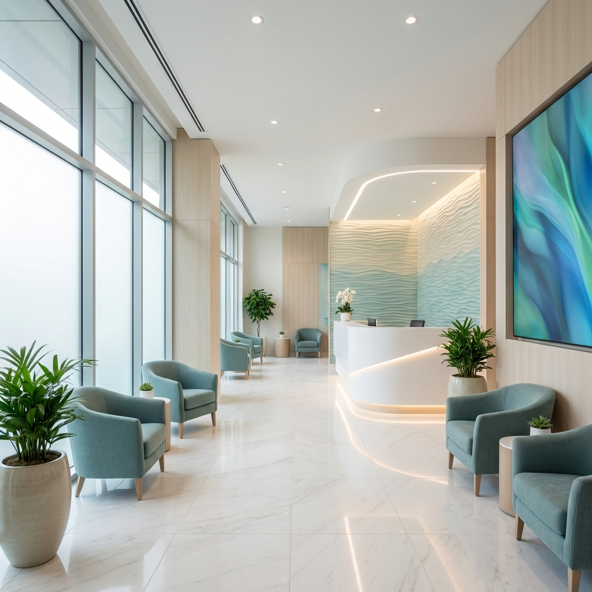

# Dr. Rupa Jaiswal Clinic Website

A modern, premium, and fully responsive clinic website built for Dr. Rupa Jaiswal, a General Physician in Kharghar, Navi Mumbai. This project uses Next.js 14, Tailwind CSS, and Shadcn UI to deliver a high-performance and visually appealing user experience.



## 🚀 Technology Stack

*   **Framework:** [Next.js 14](https://nextjs.org/) (App Router)
*   **Styling:** [Tailwind CSS v4](https://tailwindcss.com/)
*   **UI Components:** [Shadcn UI](https://ui.shadcn.com/)
*   **Animations:** [Framer Motion](https://www.framer.com/motion/)
*   **Icons:** [Lucide React](https://lucide.dev/)
*   **Font:** Outfit (Google Fonts)

## ✨ Features

*   **Premium Aesthetic:** Clean, teal-and-white medical theme with glassmorphism effects.
*   **Responsive Design:** Fully optimized for Mobile, Tablet, and Desktop devices.
*   **Interactive Elements:** Smooth scroll animations and hover effects using Framer Motion.
*   **Services Showcase:** Grid layout highlighting key medical services.
*   **Contact Integration:** Integrated Google Maps embed and appointment request form styling.
*   **SEO Optimized:** Semantic HTML and Next.js metadata optimization.

## 🛠️ Getting Started

Follow these steps to set up the project locally on your machine.

### Prerequisites

*   Node.js (v18.17 or later)
*   npm or yarn

### Installation

1.  **Clone the repository** (if applicable) or navigate to the project folder:
    ```bash
    cd rupa-jaiswal-clinic
    ```

2.  **Install dependencies:**
    ```bash
    npm install
    # or
    yarn install
    # or
    pnpm install
    ```

3.  **Run the development server:**
    ```bash
    npm run dev
    ```

4.  **Open your browser:**
    Navigate to [http://localhost:3000](http://localhost:3000) to view the application.

## 📁 Project Structure

```bash
src/
├── app/                  # Next.js App Router pages
│   ├── layout.tsx        # Root layout with fonts and metadata
│   ├── page.tsx          # Homepage composition
│   └── globals.css       # Global styles and Tailwind theme
├── components/
│   ├── custom/           # Custom built components (Hero, Navbar, etc.)
│   └── ui/               # Reusable Shadcn UI components
├── lib/                  # Utility functions
└── ...
```

## 🎨 Customizing

*   **Colors:** The theme uses CSS variables defined in `src/app/globals.css`. You can adjust the HSL values to change the primary brand colors.
*   **Content:** Edit the text and links in the individual components located in `src/components/custom/`.
*   **Images:** Place new images in the `public/images/` directory and update the references in the components.

## 📄 License

This project is for personal portfolio usage.
